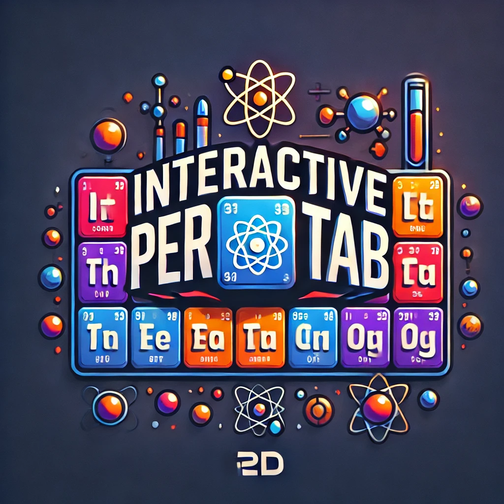

# InteractivePerTab - Tavola Periodica degli Elementi Interattiva
### Italiano

Sviluppata con il supporto della 2D CDP, questa Tavola Periodica degli Elementi interattiva potrà aiutare studenti di varie fasce d'età nello studio.
Visita il [sito di InteractivePerTab](https://interactivepertab2.webnode.page).

## Funzioni principali:

### Modellino 3D

Per ogni elemento è disponibile un modello 3D di bohr dell'atomo in questione. È possibile interagire con esso attraverso pulsanti dedicati.

### Cambiare tema

È possibile cambiare dal tema chiaro a quello scuro e viceversa semplicemente cliccando il bottone in alto a sinistra presente in ogni pagina del progetto.

### Funzione di ricerca

È possibile effettuare una ricerca per simbolo, numero o nome dell'elemento usando l'apposito campo di ricerca posto in alto a destra.

### Filtraggio per tipo

È possibile vedere evidenziati gli elementi di un determinato tipo (metalli, semimetalli, gas nobili, elementi artificiali o non metalli) cliccando sul relativo tipo nella legenda.

## Ringraziamenti

I ringraziamenti speciali vanno a:

- [@RebyCDP](https://github.com/RebyCDP) che ringrazio per aver reso possibile il coinvolgimento della classe 2D.
- [@laurabanducci93](https://github.com/laurabanducci93) che ringrazio per l'idea e la collaborazione generale.
- [@Greninja12-debug](https://github.com/Greninja12-debug) che ringrazio per aver fatto approfondimenti su alcuni elementi.

## Licenza

Questo progetto è disponibile sotto la licenza MIT con obbligo di attribuzione all'autore oroginale.
L'autore é Gionatan Venturi - Gematsam X.
Vedi il file [LICENSE](LICENSE) per ulteriori dettagli.

---

# InteractivePerTab - Interactive Periodic Table of the Elements
### English

Developed with the support of the 2D CDP, this Interactive Periodic Table of the Elements will assist students of various age groups in their studies.
Visit the [InteractivePerTab website](https://interactivepertab2.webnode.page).

## Main Features:

### 3D Model

For each element, there is a 3D Bohr model of the corresponding atom. You can interact with it through dedicated buttons.

### Theme Toggle

You can switch between light and dark themes by simply clicking the button in the upper left corner on every page of the project.

### Search Function

You can search by symbol, number, or name of the element using the search field at the top right.

### Type Filtering

You can highlight elements of a specific type (metals, metalloids, noble gases, artificial elements, or non-metals) by clicking on the respective type in the legend.

## Acknowledgments

Special thanks to:

- [@RebyCDP](https://github.com/RebyCDP) for making the involvement of the 2D class possible.
- [@laurabanducci93](https://github.com/laurabanducci93) for the idea and overall collaboration.
- [@Greninja12-debug](https://github.com/Greninja12-debug) for conducting research on some of the elements.

## License

This project is available under the MIT license with an original-author-attribution required.
The original author is Gionatan Venturi - Gematsam X.
See the [LICENSE](LICENSE) for further details.
